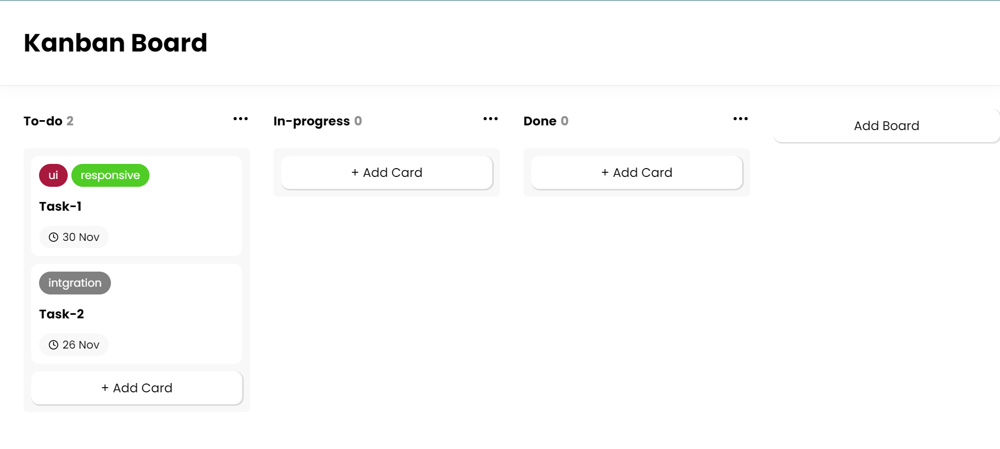

Getting Started
To use this component, follow these steps:

Clone or download the repository to your local machine.

Install the necessary dependencies by running:
npm install

Run the React development server:
yarn start
or
npm start

Open your web browser and go to http://localhost:3000 to see the component in action.